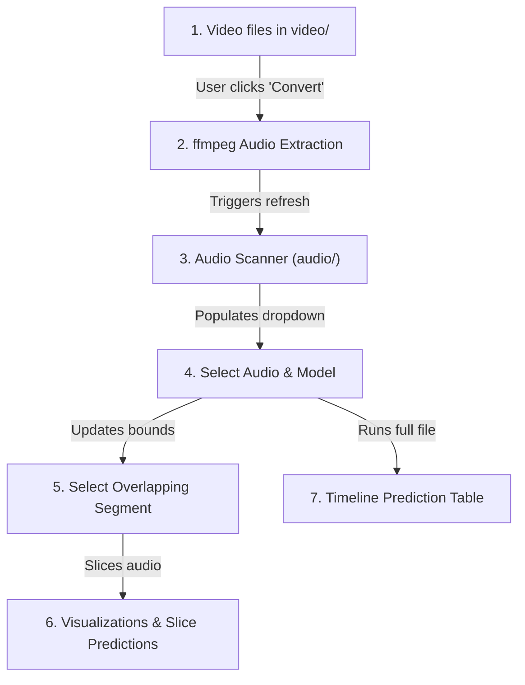

# 🔊 YouTube Audio Classifier Explorer — Notebook Guide

This document provides a comprehensive overview of the design, features, and technical architecture of **[classifier_explorer.py](file:///Users/chocodani/dev/audio_detection/audio_detection/audio-search/notebooks/classifier_explorer.py)**. 

The notebook is an interactive, reactive **Marimo** application designed to extract audio from video files, visualize sound waveforms/spectrograms, and classify environmental or security-related sounds using state-of-the-art Hugging Face models.

---

## 🗺️ Architectural Workflow

The notebook is organized into a reactive DAG (Directed Acyclic Graph) of cells that execute automatically as variables change:



---

## 🌟 Core Features

### 1. 🎥 Video Audio Extractor
* **Collapsible UI**: Contained inside a `mo.accordion` to save vertical space.
* **Workspace Scanning**: Automatically scans the `video/` directory for `.mp4`, `.mov`, and `.mkv` files.
* **FFmpeg Core**: Uses `ffmpeg` under the hood to extract the audio stream and convert it directly to a standardized **16kHz mono WAV** file.
* **Dynamic Refresh**: Updates the audio selector instantly via a custom state trigger (`mo.state`), avoiding the need to reload the notebook.

### 2. 📁 Reactive Audio Selector & Model Picker
* **Audio Scanner**: Detects all `.wav`, `.mp3`, and `.aiff` files in the organized `audio/` subfolder.
* **Model Dropdown**: Lets you choose between three pre-trained classifiers:
  1. `bioamla/ast-esc50`: Fixed 50-class environmental classifier.
  2. `MIT/ast-finetuned-audioset-10-10-0.4593`: Fixed 527-class general/environmental audio classifier (great for office sounds like typing, talking, or knocking).
  3. `laion/clap-htsat-unfused`: Zero-shot audio classifier that lets you type custom descriptions in real time.

### 3. 📝 Zero-Shot Candidate Labels Input
* **Conditional Visibility**: Only appears when the zero-shot CLAP model is selected.
* **Custom Description Area**: Allows you to enter candidate labels on new lines, which the model evaluates on the fly.

### 4. 🎚️ Overlapping Segment Selector
* **Reactive Overlap Slider**: Lets you configure the overlap duration (from `0.0` to `4.0` seconds) of the 5-second analysis window.
* **Dynamic Segment Dropdown**: Automatically calculates the exact window segments generated by the overlap setting and lets you choose one (e.g., `0.0s - 5.0s`, `4.0s - 9.0s`, `8.0s - 13.0s`).

### 5. 📊 Dual Plot Visualization & Player
* **Waveform**: Interactive matplotlib plot showing amplitude over time for the selected 5-second slice.
* **Spectrogram**: Uses a `magma` colormap to show frequency intensity over time, helping you visually identify transient sounds like clicks, drops, or speech.
* **Built-in Player**: An HTML5 player (`mo.audio`) to listen to the exact slice being analyzed.

### 6. 🚀 Timeline Classification Engine
* **Progress Bar**: Renders a loading bar as it classifies the entire recording.
* **Interactive Data Table**: Outputs an interactive, sortable, and paginated Polars table showing the classification prediction and confidence score for every overlapping window.

---

## 🛠️ Key Technical Implementations

### A. Solving the UIElement Access Error
Marimo strictly prohibits reading a UI element's `.value` in the same cell where the UI element is defined. 
* **The Problem**: Writing a layout containing `candidate_labels_input if model_picker.value == ...` in the same cell as the `model_picker` dropdown definition caused a `RuntimeError`.
* **The Fix**: The dropdown pickers are defined and returned in **Cell 1**. The value-dependent layout and candidate labels inputs are defined in **Cell 2**, which receives `model_picker` as a reactive input parameter.

### B. In-Memory WAV Bytes Conversion
Different audio models expect different native sampling rates (e.g., AST requires `16kHz`, while CLAP requires `48kHz`). Additionally, the zero-shot CLAP pipeline throws a `TypeError` if fed a standard numpy dictionary.
* **The Problem**: The pipeline preprocess functions expect a raw numpy array or in-memory file bytes. Simply converting a numpy slice without manual resampling causes a mismatch.
* **The Fix**: The notebook takes the selected segment numpy array and writes it to an in-memory byte buffer using `soundfile` with format `WAV`:
  ```python
  _buf = io.BytesIO()
  sf.write(_buf, slice_data, samplerate, format="WAV")
  _wav_bytes = _buf.getvalue()
  ```
  Passing this raw `bytes` object directly to the Hugging Face pipeline triggers the built-in `ffmpeg_read` utility. This decodes the audio and **automatically resamples it** to the model's exact target sampling rate, guaranteeing compatibility and classification accuracy without external Python dependencies like `torchaudio`.

### C. Overlap Calculation Loop
The timeline classification is driven by a sliding window step size calculation:

$$\text{Step Size} = \text{Segment Duration} - \text{Overlap Duration}$$

```python
_segment_duration = 5.0
_overlap_duration = overlap_slider.value  # e.g., 1.0s
_step_duration = _segment_duration - _overlap_duration  # e.g., 4.0s

samples_per_segment = int(_segment_duration * samplerate)
samples_per_step = int(_step_duration * samplerate)

# Strided loop over audio sample indices
for i, start_s in enumerate(range(0, len(data) - samples_per_segment + 1, samples_per_step)):
    end_s = start_s + samples_per_segment
    segment = data[start_s:end_s]
    # ...
```

---

## 🚀 How to Run the Notebook

To launch the explorer in your browser, run the following command in the `audio-search/` folder:

```bash
uv run marimo edit notebooks/classifier_explorer.py
```
