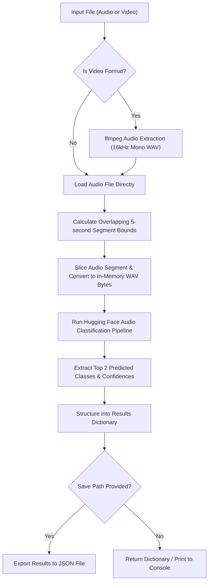

# 🔊 Audio Segment Classifier — CLI & Module Guide

This document explains the architecture, capabilities, and usage of the **[classify_segments.py](file:///Users/chocodani/dev/audio_detection/audio_detection/audio-search/src/classify_segments.py)** script. 

`classify_segments.py` is a standalone, reusable Python module and Command-Line Interface (CLI) that automates audio classification for overlapping segments, supporting both direct audio files and video files (by extracting their audio tracks dynamically).

---

## 🗺️ Architectural Workflow

The script handles the end-to-end processing pipeline in the following sequence:



---

## 🛠️ Key Functions

### 1. `extract_audio_from_video(video_path, output_audio_path=None)`
Extracts the audio track from a video file and converts it to a standard **16kHz mono WAV** file.
* **Arguments:**
  - `video_path` *(str | Path)*: Path to the input video file (e.g., `.mp4`, `.mkv`, `.mov`, `.avi`, `.webm`, `.flv`).
  - `output_audio_path` *(str | Path, optional)*: Destination path for the extracted WAV file. If not provided, it generates a temporary file.
* **Returns:**
  - `Path`: The path to the generated WAV file.
* **Requirements:**
  - Requires `ffmpeg` installed and available in the system `PATH`.

### 2. `classify_audio_segments(...)`
Slices the audio input into overlapping 5-second segments, runs the classification model, and builds the metadata dictionary.
* **Arguments:**
  - `audio_path` *(str | Path)*: Input audio or video file.
  - `model_name` *(str)*: Hugging Face model identifier (defaults to `bioamla/ast-esc50`).
  - `overlap_seconds` *(float)*: Overlap duration in seconds between segments (defaults to `1.0`).
  - `candidate_labels` *(list of str, optional)*: List of custom candidate labels for zero-shot models like CLAP.
  - `output_json_path` *(str | Path, optional)*: If specified, exports the output dictionary to a formatted JSON file.
* **Returns:**
  - `dict`: The structured metadata dictionary containing bounds, durations, and top 2 segment predictions.

---

## 🚀 Usage Examples

### 1. Command-Line Interface (CLI)
You can run the script directly from the terminal inside the `audio-search` directory.

#### Basic Usage (Audio File):
```bash
uv run python src/classify_segments.py --audio audio/clean.wav --output results/clean_results.json
```

#### Automatic Audio Extraction (Video File):
```bash
uv run python src/classify_segments.py --audio video/2026-03-14_12-28-47.mp4 --output results/video_results.json
```

#### Customize Model & Overlap:
```bash
uv run python src/classify_segments.py \
  --audio audio/clean.wav \
  --model MIT/ast-finetuned-audioset-10-10-0.4593 \
  --overlap 2.5 \
  --output results/audioset_results.json
```

#### Zero-Shot Classification (CLAP model with custom candidate labels):
```bash
uv run python src/classify_segments.py \
  --audio audio/clean.wav \
  --model laion/clap-htsat-unfused \
  --labels "dog barking" "office noise" "normal conversation" "silence" \
  --output results/clap_results.json
```

#### CLI Help Flag:
```bash
uv run python src/classify_segments.py --help
```

---

### 2. Programmatic Python Import
You can import the module and run classification in your own custom Python pipelines.

```python
from src.classify_segments import classify_audio_segments

# Run segment-by-segment classification on a video file
results = classify_audio_segments(
    audio_path="video/2026-03-14_12-28-47.mp4",
    model_name="bioamla/ast-esc50",
    overlap_seconds=1.5,
    output_json_path="results/output_results.json"
)

# Access findings directly in Python
print(f"Total Duration: {results['input_duration_seconds']}s")
for seg in results["segments"]:
    start = seg["start_time"]
    end = seg["end_time"]
    top_pred = seg["predictions"][0]
    print(f"[{start}s - {end}s] Predicted: {top_pred['class']} ({top_pred['confidence']:.2%})")
```

---

## 📊 Structured JSON Output Format

The generated JSON file is formatted as follows:

```json
{
  "input_file": "2026-03-14_12-28-47.mp4",
  "input_duration_seconds": 52.096,
  "model_name": "bioamla/ast-esc50",
  "overlap_seconds": 1.0,
  "segments": [
    {
      "segment_index": 0,
      "start_time": 0.0,
      "end_time": 5.0,
      "predictions": [
        {
          "class": "washing_machine",
          "confidence": 0.9969556331634521
        },
        {
          "class": "vacuum_cleaner",
          "confidence": 0.0008188345818780363
        }
      ]
    },
    {
      "segment_index": 1,
      "start_time": 4.0,
      "end_time": 9.0,
      "predictions": [
        {
          "class": "dog",
          "confidence": 0.565256655216217
        },
        {
          "class": "laughing",
          "confidence": 0.13001540303230286
        }
      ]
    }
  ]
}
```

---

## ⚡ Device & Performance Acceleration
- **GPU Acceleration**: The script automatically detects Apple Silicon hardware and will use **Metal Performance Shaders (`mps`)** on macOS for fast, hardware-accelerated classification inference. If run on other operating systems, it automatically falls back to CPU.
- **Automatic Audio Normalization**: Sliced segment data is compiled into in-memory WAV buffers using `soundfile` before classification. The Hugging Face pipeline decodes this WAV stream and automatically resamples the audio to match the classification model's expected native rate (e.g., `16kHz` for AST, `48kHz` for CLAP), eliminating manual resampling logic.
